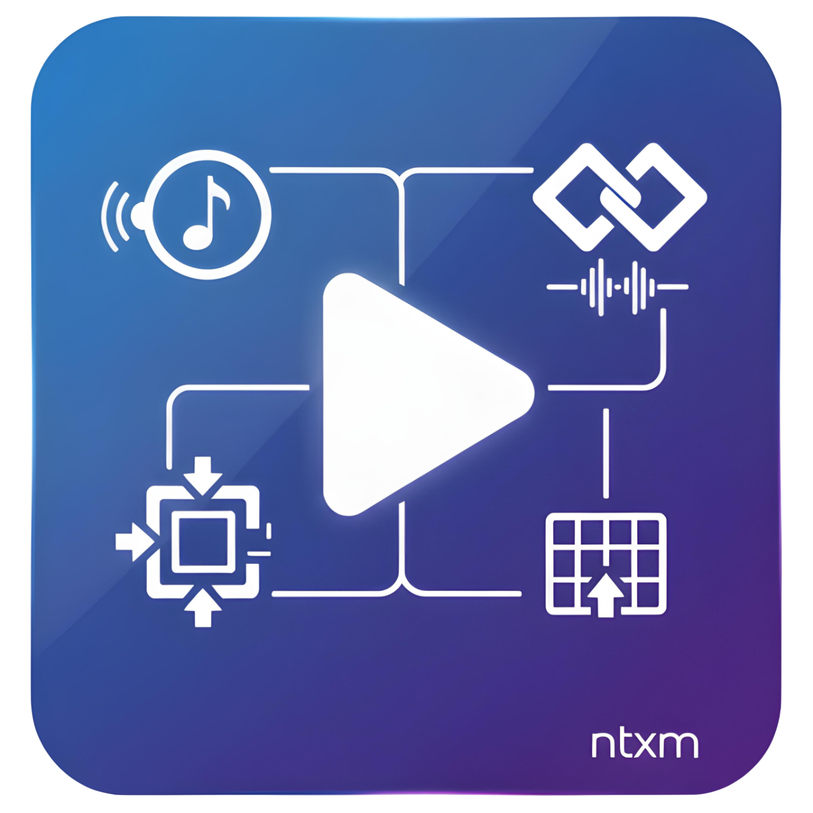
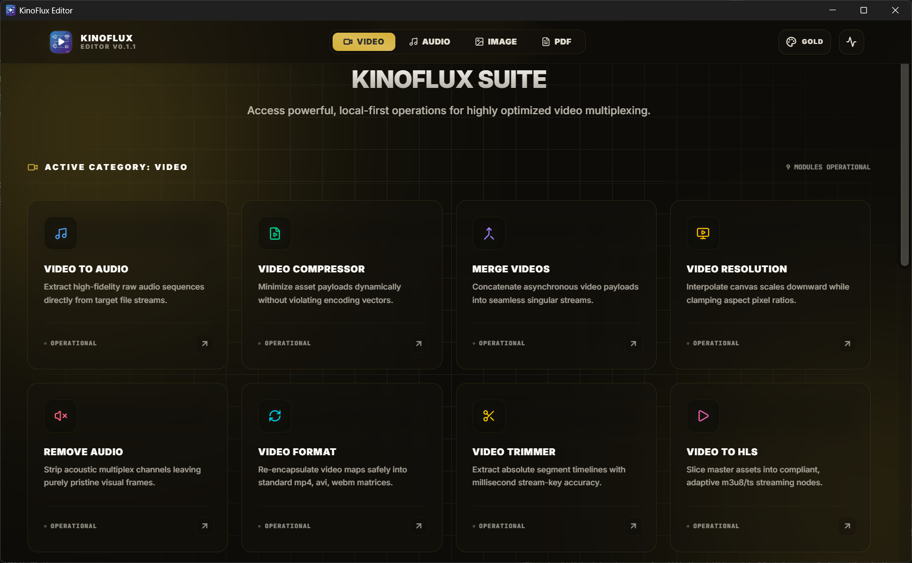
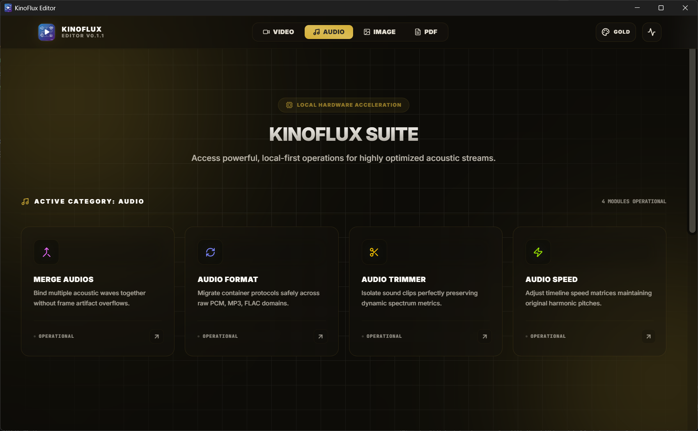
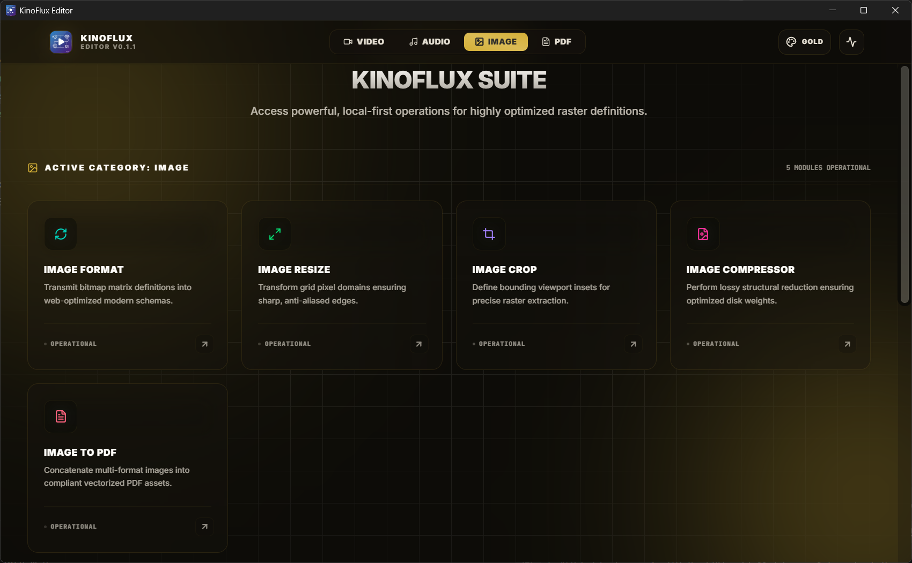
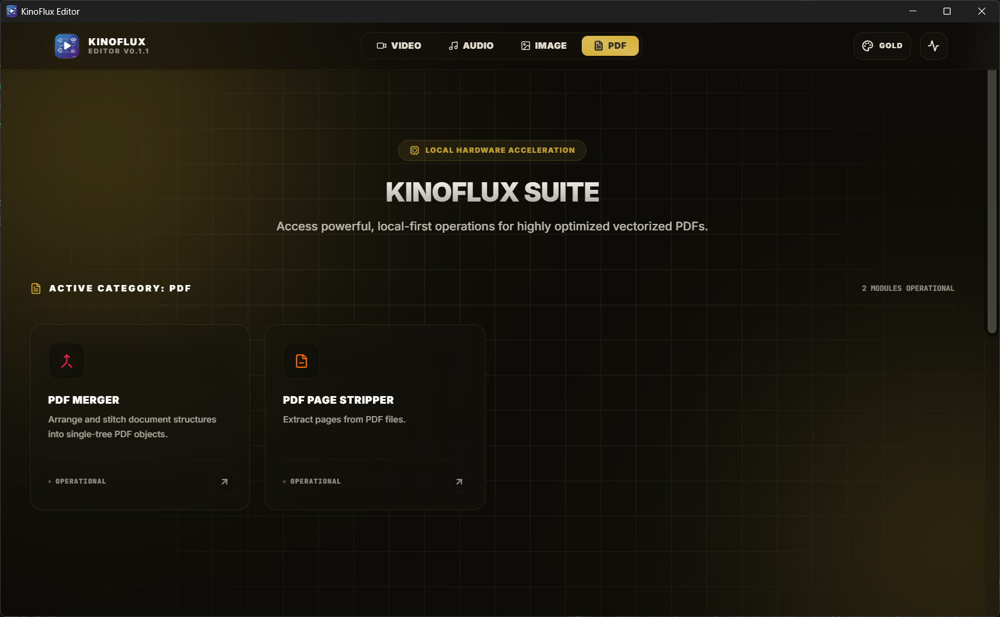

  
  <h1>KinoFlux Suite</h1>
  
<strong>The Premium, Ultra-Fast, Fully Offline Media Utility Suite for Windows</strong>

  

    <a href="#⚡-the-core-promise">The Promise</a> •
    <a href="#🛸-the-toolkit">Toolkit Overview</a> •
    <a href="#🖼️-visual-showcase">Showcase</a> •
    <a href="#💿-quick-start">Installation</a>
  

---

## ⚡ The Core Promise

**KinoFlux Suite** is a premium desktop environment crafted for creators, professionals, and everyday users who need powerful file processing without the friction of traditional cloud utilities. 

No subscriptions. No user accounts. No slow remote servers.  
Just raw, hardware-accelerated desktop power.

*   **💎 Elite SaaS Aesthetics**: A beautiful, modern interface featuring vibrant accents, glassmorphic overlays, and elegant fluid transitions.
*   **🎨 Dynamic Theme Engine**: Adapts instantly to your visual vibe with integrated palettes that shift the entire workspace canvas dynamically.
*   **🔒 Pure Zero-Cloud Privacy**: Your sensitive videos, audios, and documents never leave your local memory buffer. Fully offline, 100% secure.
*   **🚀 Bare-Metal Speed**: Harnesses localized sub-processors and hardware acceleration to cut, encode, and compile files in fractions of the standard time.

---

## 🛸 The Toolkit

KinoFlux wraps mission-critical media handlers into intuitive, single-click modules.

### 🎬 Video Multiplexing
*   **Real-Time Video Trimmer**: Visually scrub, preview, and extract segments with precise mark-in/out loops.
*   **Lossless Video Merger**: Splice multiple formats into a single stream sequentially.
*   **Format & Resolution Scaling**: Shift resolutions or convert formats using hardware acceleration.
*   **Streaming Toolkit**: Re-package raw clips into production-ready HLS streams instantly.

### 🎵 Acoustic Design
*   **Soundwave Trimmer**: Trim audio tracks with an interactive, bouncing soundwave visualizer grid.
*   **Format Cross-Converters**: Shift bitrates and codecs across all major audio formats.
*   **Pace Modulation**: Tweak audio playback speeds without damaging stream continuity.

### 🖼️ Raster Definitions (Image Utilities)
*   **Optimized Compactor**: Shrink large raster assets without damaging pixel clarity.
*   **Dynamic Resizer & Cropper**: Modify pixel grids and crop bounds with instant viewport feedback.
*   **Document Binder**: Package stacks of different image formats into compliant, vectorized PDFs.

### 📄 Vectorized Sheets (PDF Utilities)
*   **Vector Page Stripper**: Extract or prune isolated sheets from complex PDF documents.
*   **PDF Merger**: Stitch separate document volumes into unified PDF assets effortlessly.

---

## 🖼️ Visual Showcase

Explore the premium workspace interfaces designed for absolute productivity:

### 🎥 Video Production Hub

<em>Ultra-clean modules for trimming, merging, and hardware-accelerated format scaling.</em>

 

### 🎧 Acoustic Stream Workspace

<em>Sleek tools for pacing, format conversions, and real-time audio previews.</em>

 

### 🖼️ Image Processing Studio

<em>Compress, resize, crop, and bind image queues into compliant PDF portfolios.</em>

 

### 📄 Professional Document Center

<em>Zero-telemetry PDF page removal, extraction, and multi-document bundling.</em>

---

## 💿 Quick Start

Designed exclusively for **Windows 64-bit** environments.

1.  🚀 Head to the official [GitHub Releases Registry](https://github.com/ntxmproducts/kinoflux-editor/releases).
2.  📦 Fetch the latest `.msi` installer for the **v0.1.1 Current Cycle**.
3.  ⚙️ Run the setup wrapper to register the local registries.
4.  ✨ Launch **KinoFlux Suite** and start processing files immediately.

---

  
Synthesized by System Architects at <a href="https://ntxm.org">NTXM.org</a>

